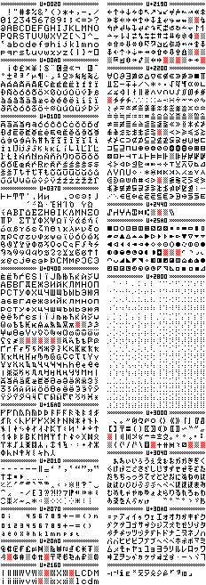
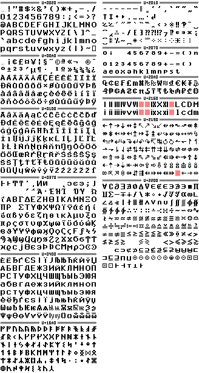

# Unicode fonts

This repository contains Unicode fonts that support most of the common Unicode
blocks. They can be used in C.Basic with the custom font mechanism or in
add-ins if there is a font manager (as of March 2021 only gint has one).

There are currently two fonts in this repository:

* [uf5x7: A 5x7 Unicode extension for fx-9860G](#uf5x7-an-unicode-extension-for-fx-9860g)
* [uf8x9: An original Unicode font for fx-CG](#uf8x9-an-original-unicode-font-for-fx-cg)

The fonts are **under CC0**, there are no conditions for using them. A link
back here would be appreciated though!

Related topic on Planète Casio: [Police 5x7 Unicode pour add-ins et C.Basic](https://www.planet-casio.com/Fr/forums/topic15732-1-Police-5x7-Unicode-pour-add-ins-et-C.Basic.html)

## uf5x7: An Unicode extension for fx-9860G

uf5x7 is a basic Unicode font mostly suitable for calculators of the fx-9860G
series (the ones with small 128x64 displays).


Supported blocks:

* `U+0020 .. U+007F` - ASCII (128 chars)
* `U+00A0 .. U+00FF` - Latin-1 Supplement (96 chars)
* `U+0100 .. U+017F` - Latin Extended-A (128 chars)
* `U+0370 .. U+03FF` - Greek (144 chars)
* `U+0400 .. U+047F` - Cyrillic (128 chars)
* `U+16A0 .. U+16FF` - Runic (96 chars)
* `U+2010 .. U+205F` - General punctuation (80 chars)
* `U+2070 .. U+209F` - Subscripts and superscripts (48 chars)
* `U+20A0 .. U+20BF` - Currency symbols (32 chars - thanks @Alice!)
* `U+2160 .. U+217F` - Roman numerals (32 chars)
* `U+2190 .. U+21FF` - Arrows (112 chars)
* `U+2200 .. U+22FF` - Mathematical operators (256 chars)
* `U+2440 .. U+244F` - Optical character recognition (16 chars - thanks @Alice!)
* `U+25A0 .. U+25FF` - Geometric shapes (96 chars)
* `U+2800 .. U+28FF` - Braille patterns (256 chars - thanks @Alice!)
* `U+3000 .. U+303F` - CJK Punctuation (48 chars - thanks @Alice!)
* `U+3040 .. U+309F` - Hiragana (96 chars)
* `U+30A0 .. U+30FF` - Katakana (96 chars)

The following blocks are being considered for future support:

* Finish Cyrillic
* IPA extensions and Phonetic extensions

Other characters supported in `FONTCHARACTER` (incomplete list):

* `U+2139` - Imaginary number
* `U+231F` - Fraction symbol

Full font:



## uf8x9: An original Unicode font for fx-CG

uf8x9 is a font designed specifically for the large fx-CG display (396x224),
which is thin vertically and thick horizontally.

Supported blocks:

* `U+0020 .. U+007F` - ASCII (128 chars)
* `U+00A0 .. U+00FF` - Latin-1 Supplement (96 chars)
* `U+0100 .. U+017F` - Latin Extended-A (128 chars)
* `U+0370 .. U+03FF` - Greek (144 chars)
* `U+0400 .. U+047F` - Cyrillic (128 chars)
* `U+16A0 .. U+16FF` - Runic (96 chars)
* `U+2010 .. U+205F` - General punctuation (80 chars)
* `U+2070 .. U+209F` - Subscripts and superscripts (48 chars)
* `U+20A0 .. U+20BF` - Currency symbols (32 chars)
* `U+2160 .. U+217F` - Roman numerals (32 chars)
* `U+2190 .. U+21FF` - Arrows (112 chars)
* `U+2200 .. U+22FF` - Mathematical operators (256 chars - partial!)

Full font:



## Constructing full font images

Use `gen.py` too generate the full images from the sections. You will need
Python 3 and Pillow (PIL might be okay).

```sh
% ./gen.py uf5x7/ uf5x7.png
% ./gen.py uf8x9/ uf8x9.png
```

It will read each block's position from its file name (which should be on the
form `U\+[0-9A-Fa-f]{4}.png`). For image files with a different name, it will
output an anonymous block.

The file `gen-chars.png` provides some character templates for it to render the
full image.

## Using in C.Basic

TODO - Check out the [documentation](https://egadget2.web.fc2.com/CBasic/Interpreter/CBasic_interpreter.html) (egadget2.web.fc2.com)
for extended font support.

## Using in gint

To convert the font with `fxconv`, pass the name of a folder containing
block images instead of a simple image and set `charset` to `unicode`. Note
that in this setting, `area` is ignored and the same grid parameters are
applied to all block images.

```sh
% fxconv -f uf5x7/ name:uf5x7 charset:unicode grid.size:5x7 grid.padding:1
% fxconv -f uf8x9/ name:uf8x9 charset:unicode grid.size:8x11 grid.padding:1 proportional:true height:9
```

When using the fxSDK, add the `uf5x7` folder to your list of metadata files and
set the type as `font`.

```
uf5x7: # Note that this is a folder
  type: font
  name: uf5x7
  charset: unicode
  grid.size: 5x7
  grid.padding: 1

uf8x9:
  type: font
  name: uf8x9
  charset: unicode
  grid.size: 8x11
  grid.padding: 1
  proportional: true
  height: 9
```

To use the font, configure it with `dfont()`, then call `dtext()` as usual.
Make sure the string is encoded as UTF-8. The `u8` prefix can be used if your
source file is not encoded as UTF-8.

```c
#include <gint/display.h>
extern font_t uf5x7, uf8x9;

dfont(&uf5x7);
dtext(5, 5, C_BLACK, "Mézalors Δ=2 ⇒ ∀x∈S, x⊆Δ");

dfont(&uf8x9);
dtext(5, 15, C_BLACK, "Δt+(3-θ²)! Eurêka!");
```
